https://colab.research.google.com/drive/1dKO9C5l-8SP0n9qsh2_Ci0eKzsiCuldM?usp=sharing
 
Список 10-ти гистоновых меток (и соотв имен файлов) , для которых был сделан анализ 
Hsmm	Ctcf	CtcfStdAlnRep1.bam	ControlStdAlnRep1.bam 
Hsmm	Ezh239875	Ezh239875AlnRep1.bam	ControlStdAlnRep1.bam 
Hsmm	H2az	H2azfStdAlnRep1.bam	ControlStdAlnRep1.bam 
Hsmm	H3k4me1	H3k4me1StdAlnRep1.bam	ControlStdAlnRep1.bam 
Hsmm	H3k9ac	H3k9acStdAlnRep1.bam	ControlStdAlnRep1.bam 
Hsmm	H3k27me3	H3k27me3StdAlnRep1.bam	ControlStdAlnRep1.bam 
Hsmm	H3k36me3	H3k36me3StdAlnRep1.bam	ControlStdAlnRep1.bam 
Hsmm	CH3k79me2	H3k79me2StdAlnRep1.bam	ControlStdAlnRep1.bam 
Hsmm	H4k20me1	H4k20me1StdAlnRep1.bam	ControlStdAlnRep1.bam 
Hsmm	H3k4me2	H3k4me2StdAlnRep1.bam	ControlStdAlnRep1.bam 
Картинки из выдачи ChromHMM
 
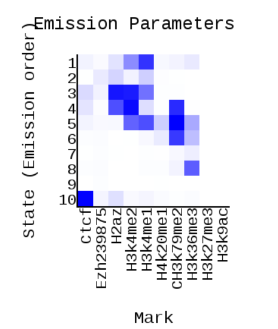
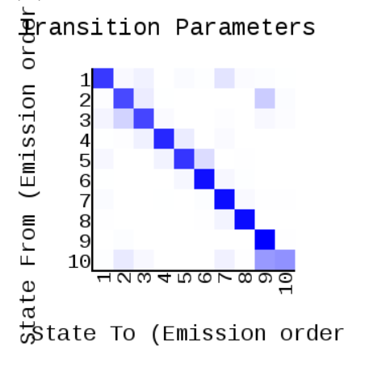
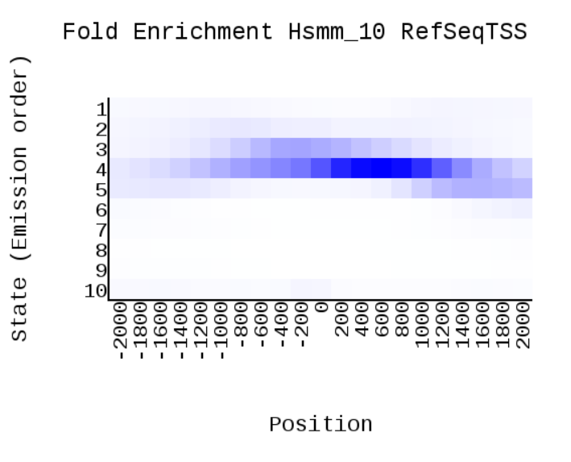
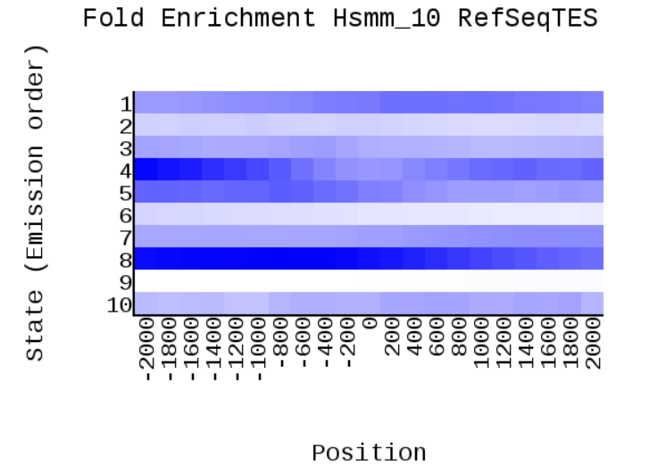
 
Табличка с номерами эпигенетических типов, их характерные эпигенетические метки и другие свойства, а также присвоенные им названия
 
скрин | комментарии | выбор
--- | --- | ---
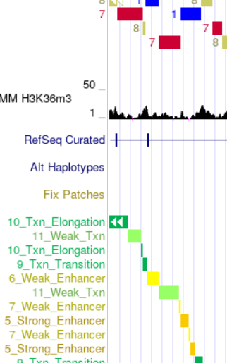| исходя из выдачи ChromHMM типичные метки - H3k4me1 и H3k4me2 | 5_Strong enhancer
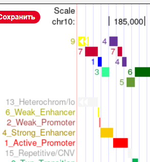 | типичные метки -  H3k4me2, H2az, CH3k79me2б часто попадает на гены(экзоны)| 1_Active Promoter
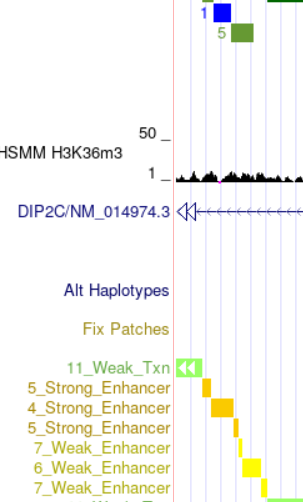|типичные метки -CH3k79me2, H3k4me1 и H3k4me2| 4_Strong enhancer
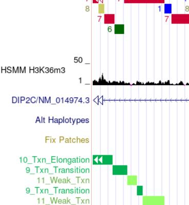|типичные метки -CH3k79me2, на гены не попадает| 9_Transcriptional transition
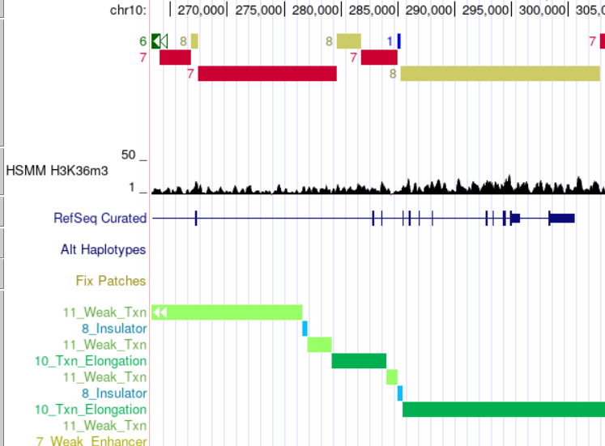|типичные метки -нет, часто попадает на экзоны | 11_Weak transcribed
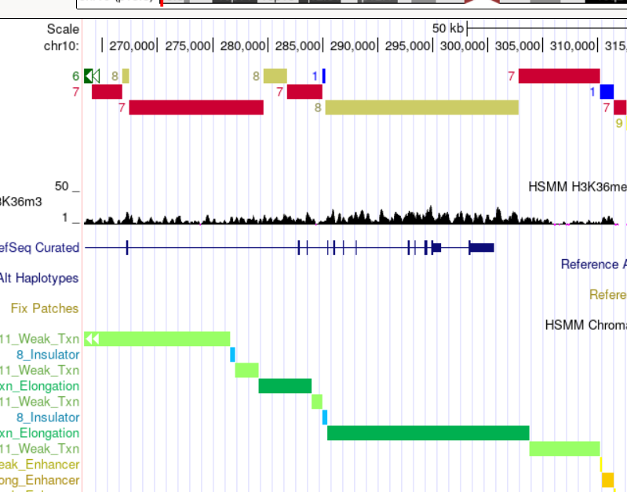|типичные метки -H3k36me3, часто попадает на интроны | 10_Transcriptional elongation
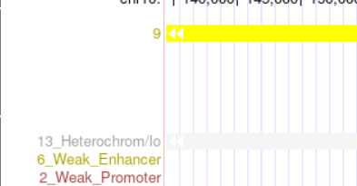|типичные метки - нет | 13_Heterochromatin; low signal
 
Остальные состояния либо не встречаются, либо встречаются слишком на короткий период
 
Бонус
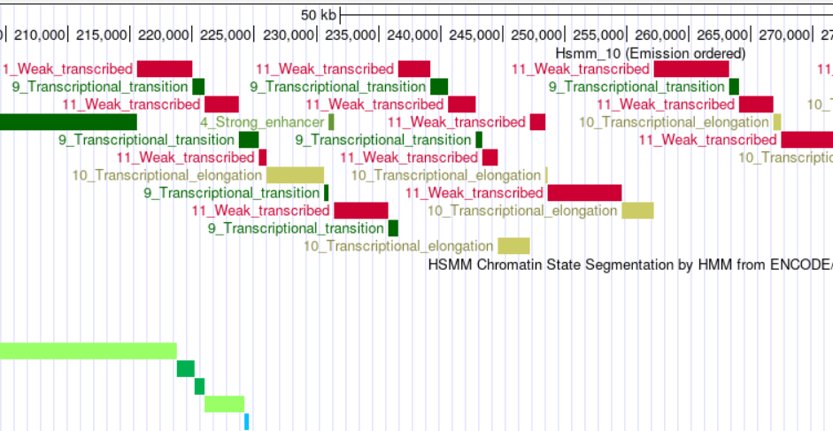
